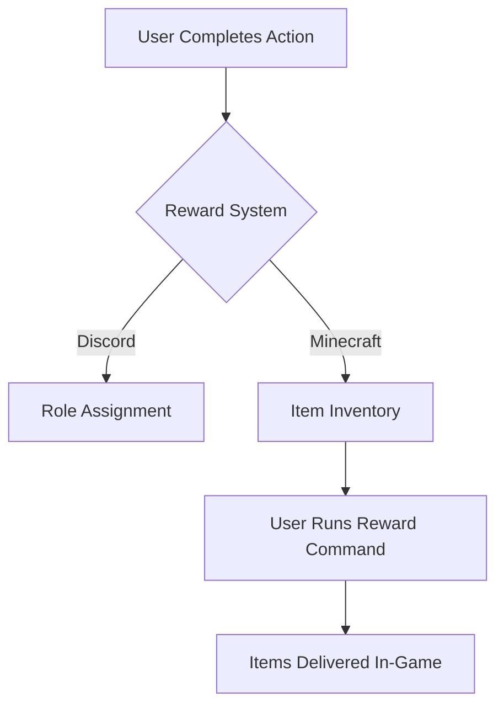

# 🎁 MineBot Reward System Guide

## Overview

The MineBot reward system provides a powerful way to engage your community by automatically granting benefits to users across multiple touchpoints. This system creates seamless connections between your Discord community and Minecraft servers, allowing you to incentivize desired actions and behaviors.

## ✨ Key Features

- **Dual Reward Types**: Grant both Discord roles and Minecraft in-game items
- **Server-Specific Rewards**: Configure different rewards for each Minecraft server
- **Command-Triggered Delivery**: Items are given when players request them via Discord
- **Customizable Commands**: Full control over what items or benefits players receive
- **Cross-Command Integration**: Use rewards in commands that support the reward feature

## 🔄 How It Works



### The Process:

1. User completes a reward-eligible action (linking account, participating in event, etc.)
2. The system validates the action completion
3. Upon successful verification:
   - Discord rewards (roles) are immediately assigned
   - Minecraft rewards are stored in the user's inventory
4. When the player wants to claim their rewards:
   - They run a reward claim command in Discord
   - The bot automatically delivers their server-specific rewards

## ⚙️ Global Configuration

The reward system's core settings are defined in your `settings.json` file. Here's an example from the account linking command:

```json
"reward": {
  "mode": "BOTH",
  "role": [1371228108598018089],
  "item": {
    "test1": ["give {minecraft_username} diamond 1"],
    "default": ["give {minecraft_username} apple 1"]
  }
}
```

### Settings Explained:

| Setting | Description                  | Options                                  |
| ------- | ---------------------------- | ---------------------------------------- |
| `mode`  | Which reward types to enable | `ROLE`, `ITEM`, or `BOTH`                |
| `role`  | Discord role IDs to assign   | Array of role IDs                        |
| `item`  | Minecraft commands to run    | Object mapping servers to command arrays |

## 🧩 Advanced Features

### Variable Substitution

Your reward commands can include special placeholders:

- `{minecraft_username}` - Replaced with the player's Minecraft username
- `{minecraft_uuid}` - Replaced with the player's Minecraft UUID

### Default Rewards

The special `default` key defines a fallback for servers not specifically listed:

```json
"item": {
  "survival": ["give {minecraft_username} diamond 5"],
  "creative": ["give {minecraft_username} emerald 3"],
  "default": ["give {minecraft_username} apple 1"]
}
```

In this example:

- Player get 5 diamonds on "survival" server
- Player get 3 emeralds in "creative" server
- Player get 1 apple in any other server

If you only specify the `default` key without other server names, those rewards will apply to all servers, saving you from writing the same commands repeatedly.

## 📋 Command Integration

The reward system can be integrated into commands that support this feature:

### Account Linking

```json
"link_account": {
  "reward": {
    "mode": "BOTH",
    "role": [1371228108598018089],
    "item": {
      "test1": ["give {minecraft_username} diamond 1"],
      "default": ["give {minecraft_username} apple 1"]
    }
  }
}
```

> **Note:** Only commands that explicitly support the reward feature can utilize this system.

## 🔍 Troubleshooting

| Issue                               | Solution                                                                                                |
| ----------------------------------- | ------------------------------------------------------------------------------------------------------- |
| Rewards not delivered               | Verify the player's Minecraft account is properly linked                                                |
| Role not assigned                   | - Check that the bot has proper permissions in your Discord server<br>- Check if the role ID is correct |
| Server-specific rewards not working | Ensure the server name in settings matches your actual server name                                      |
